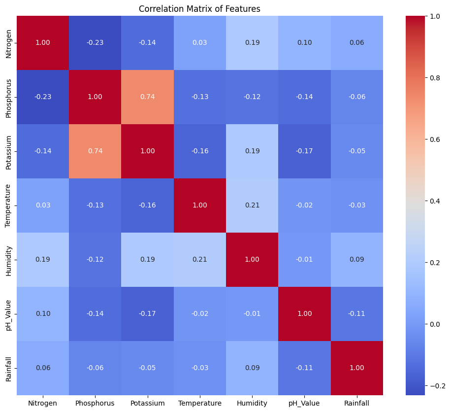
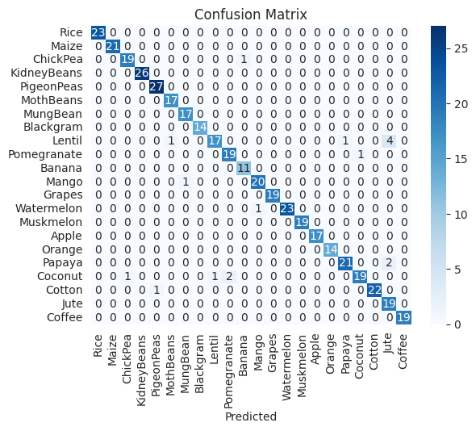

### Table of Contents
- [Crop Recommendation System](#crop-recommendation-system)
- [Introduction](#introduction)
- [Data](#data)
  - [Features:](#features)
  - [Missing Values](#missing-values)
  - [Correaltion Matrix](#correaltion-matrix)
  - [Confusion Matrix](#confusion-matrix)
- [Dependencies](#dependencies)
- [Usage](#usage)
- [Contributing](#contributing)

## Crop Recommendation System

The Crop Recommendation System was built using Logistic Regression which achieved an testing accuracy of ***96.14 %*** and F1 Score of ***96.10 %***. The goal is to recommend the best crop to plant based on various soil and environmental conditions such as Nitrogen, Phosphorus, Potassium levels, Temperature, Humidity, pH value, and Rainfall.


## Introduction
The Crop Recommendation System uses machine learning algorithms to analyze soil and environmental data to recommend the most suitable crop to plant. This can help farmers make informed decisions and optimize their crop yields.

## Data
The dataset used in this project contains information about soil nutrients, temperature, humidity, pH value, and rainfall, along with the type of crop grown under those conditions.

### Features:
- Nitrogen - the ratio of Nitrogen content in the soil
- Phosphorus - the ratio of Phosphorus content in the soil
- Potassium - the ratio of Potassium content in the soil
- Temperature - temperature in degrees Celsius
- Humidity - relative humidity in %
- pH_Value - pH value of the soil
- Rainfall - rainfall in mm

### Missing Values
It was found that the dataset didn't contain any missing values.

### Correaltion Matrix


### Confusion Matrix



## Dependencies
To run the notebook, you will need the following Python libraries:
- pandas
- numpy
- matplotlib
- plotly
- seaborn
- scikit-learn

You can install the required libraries using the following command:
```bash
pip install pandas numpy matplotlib plotly seaborn scikit-learn
```

## Usage
1. Clone the repostory
```bash
git clone https://github.com/SleepyMiner/Crop-Recommendation.git
```

2. Navigate to repository directory

```bash
cd Crop-Recommendation
```
3. Open the Jupyter Notebook

```bash
juypter notebook CropRecommendation.ipynb
```

## Contributing
Contributions are welcome! If you have any suggestions or improvements, please open an issue or submit a pull request.